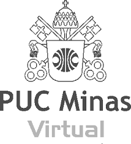

  

# Eixo-5 🏗️
Arquitetura de Dados em Nuvem ☁️

# _ASK YOUR DATA_ - Processamento de Documentos PDF e Busca Contextual com Modelos LLM 📄🔍
`TECNOLOGIA EM BANCO DE DADOS` `2024/2º Semestre`

Desenvolvimento de uma interface fácil de usar, onde é possível fazer o upload de arquivos PDF para que o texto seja processado e convertido em informações que podem ser pesquisadas. Essas informações são guardadas em um banco de dados especial (Qdrant), e um modelo inteligente é utilizado para encontrar e fornecer respostas que fazem sentido com base no conteúdo dos documentos.

## Integrantes 👥
* Amanda Barbosa Souza
* Edvaldo Gutierres Ferreira
* Flavio Nery Rezende
* Nalanda Gonçalves de Oliveira
* Natália Ferreira de Carvalho

## Orientador 👨‍🏫
* Cristiano Geraldo Teixeira Silva

# Documentação 📑

| Etapa         | Atividades |
|  :----:   | ----------- |
| ETAPA 1        |[Documentação de Contexto](/ask_your_data/docs/documentacao_contexto.md) |
| ETAPA 2        |[Coleta de Dados](projeto/coleta_dados.md) |
| ETAPA 3        |[Pré-processamento](projeto/pre_processamento.md) |
| ETAPA 4        |[Aprendizagem de Máquina](projeto/aprendizado_maquina_rev.md)|
| ETAPA 5        |[Análise dos Resultados](projeto/analise_resultados.md) |
| ETAPA 6        |[Otimização](projeto/Otimizacao.md) |

---
